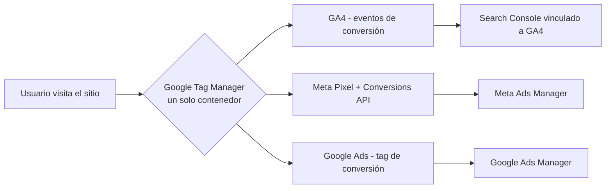
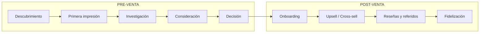

# Guía 360° de Marketing Digital para Pymes (2026)

**Ámbito:** auditoría y hoja de ruta práctica para una pyme que está modernizando su marketing digital — SEO, SEM/Ads, Funnels comerciales, redes orgánicas y visibilidad en IA generativa (AEO/GEO).
**Fecha del estudio:** 18 de agosto de 2026.
**Preparado para:** Estudio Jurídico Boutique — Defensor del Contribuyente, y como playbook reutilizable para futuras auditorías internas.
**Cómo se construyó:** metodología cruzada de tres skills internas de auditoría (SEO, Meta Ads, Negocio Digital/Funnels), más investigación del estado del arte en BigSEO (agencia-sem, agencia-seo, agencia-funnels), Yoast (SEO Premium + Yoast SEO AI+), Metrix Digital (casos de estudio con cifras reales) y las políticas/cambios recientes de Google, Meta, TikTok y LinkedIn. Fuentes completas al final del documento.

---

## Cómo usar esta guía

1. **No es para ejecutar tú solo/a.** Es el documento que le entregas a la agencia o a los profesionales que van a intervenir (SEO, growth/paid media, CRO/copy, desarrollo web) para que todos trabajen sobre el mismo diagnóstico y las mismas prioridades.
2. **Sigue el orden de las secciones.** Está ordenado igual que el orden real de ejecución: primero medición (sin esto no puedes ver si algo funciona), luego SEO y SEM, luego funnels/CRO, luego redes orgánicas, y al final AEO (visibilidad en IA).
3. **Cada sección tiene un checklist accionable** con prioridad, cómo verificar que está hecho, y un recurso oficial para quien lo ejecute.
4. **La Sección 8** es la matriz de priorización — úsala para decidir qué se hace esta semana, este mes y este trimestre en lugar de intentarlo todo a la vez.
5. **La Sección 9** es la checklist maestra imprimible, pensada para llevar a una reunión con la agencia.

---

## 1. Medición y Tracking — la base de todo

Sin esto, ninguna cifra de las siguientes secciones es confiable. Es lo primero que se corrige en cualquier traspaso o auditoría (así se hizo ya en [Alcance Técnico — SEO](../seo/alcance-tecnico-seo.md) y en [Alcance Técnico — Landing/Meta Ads](../landing/alcance-tecnico-landing-meta-ads.md) de este mismo repositorio).

### Checklist

| Prioridad | Tarea | Cómo verificar | Recurso |
|---|---|---|---|
| Crítica | Un solo contenedor de Google Tag Manager (sin duplicados) | Ver código fuente de la home: debe aparecer una sola vez `GTM-XXXXXXX` | [Ayuda de Google Tag Manager](https://support.google.com/tagmanager) |
| Crítica | Meta Pixel instalado en todo el sitio + evento `Lead`/`Purchase` configurado | Meta Events Manager → "Probar eventos" | [Conversions API (Meta for Developers)](https://developers.facebook.com/docs/marketing-api/conversions-api) |
| Crítica | Conversions API (server-side) activa, no solo el Pixel | En 2026, entre 20-35% de las conversiones que reporta Meta ya son modeladas por IA porque el tracking 1:1 post-iOS es incompleto; sin CAPI, se subestima el rendimiento real de las campañas | ídem |
| Alta | GA4 configurado con eventos de conversión (no solo "page_view") | GA4 → Informes → Interacción → Eventos | [Google Analytics Academy](https://analytics.google.com/analytics/academy/) |
| Alta | Search Console verificado y vinculado a GA4 | Search Console → Configuración → Vinculaciones | [Search Console Help](https://support.google.com/webmasters) |
| Media | UTMs estandarizados para toda campaña paga (naming convention único) | Revisar reportes: si hay 5 formas distintas de escribir la misma campaña, no hay convención | — |
| Media | WhatsApp Business API — revisar el modelo de cobro vigente antes de automatizar mensajería | Desde el 1-jul-2025 el cobro pasó de por conversación a por plantilla; desde el 1-ago-2026 se cobra también por mensajes de Meta Business Agent | [WhatsApp Business Platform — pricing](https://developers.facebook.com/documentation/business-messaging/whatsapp/pricing) |

---

## 2. SEO — On-page, técnico, local y de autoridad

Metodología de referencia: la skill interna `auditoria-seo` (8 categorías ponderadas: meta tags, headings, imágenes, enlaces, Open Graph, schema, técnico, contenido) más el enfoque de BigSEO (keyword research → arquitectura → auditoría técnica → implementación priorizada por retorno → autoridad).

### Checklist

| Prioridad | Tarea | Cómo verificar | Recurso |
|---|---|---|---|
| Alta | Title (50-60 car.) y meta description (150-160 car.) únicos por página, con keyword objetivo | Screaming Frog / revisión manual del `<head>` | [Search Central — Cómo escribir buenos títulos](https://developers.google.com/search/docs/appearance/title-link) |
| Alta | Un solo `<h1>` por página, jerarquía de encabezados sin saltos | Inspeccionar HTML | — |
| Alta | Core Web Vitals en verde (LCP, INP, CLS) | [PageSpeed Insights](https://pagespeed.web.dev/) | [Search Central — Core Web Vitals](https://developers.google.com/search/docs/appearance/core-web-vitals) |
| Alta | Datos estructurados (`LocalBusiness`, `Service`, `FAQPage`, `Article`) sin errores | [Rich Results Test](https://search.google.com/test/rich-results) | [Search Central — Structured Data](https://developers.google.com/search/docs/appearance/structured-data/intro-structured-data) |
| Alta | Ficha de Google Business Profile reclamada, con fotos recientes y respuesta a reseñas (positivas y negativas) | Buscar el negocio en Google Maps | [Ayuda de Google Business Profile](https://support.google.com/business) |
| Media | Sitemap.xml y robots.txt accesibles y correctos | `tudominio.cl/sitemap.xml` y `/robots.txt` | — |
| Media | Enlazado interno: sin páginas huérfanas (sin enlaces entrantes) | Auditoría de enlaces internos | — |
| Media | Perfil de backlinks sin señales de "SEO enlatado" (compra masiva de enlaces de baja calidad) | Revisar en Search Console → Enlaces | — |
| Nueva (2026) | **Google Search Console → activar/desactivar el control granular de AI Overviews/AI Mode** según la estrategia de la marca | Search Console → Configuración | [Blog Google — nuevos controles para sitios web](https://blog.google/products-and-platforms/products/search/new-controls-website-owners/) |

**Contexto 2025-2026 que cambia las reglas:**
- Google confirmó 3 *core updates* en 2025 y 4 en lo que va de 2026 — el de mayo 2026 fue el más volátil registrado. Google insiste en el mismo criterio de siempre: contenido *"helpful, people-first"* con E-E-A-T; no hay penalización dirigida a un nicho, hay recálculo de relevancia. ([Search Central — Core Updates](https://developers.google.com/search/docs/appearance/core-updates))
- **AI Overviews ya aparece en ~48% de las búsquedas** y reduce el CTR orgánico entre 34% y 61% cuando se muestra. En AI Mode (búsqueda conversacional) el zero-click llega a 93%. Pero las páginas **citadas** dentro de un AI Overview reciben ~120% más clics por impresión que las no citadas en la misma consulta — la meta ya no es solo "salir primero", es "ser la fuente que la IA cita". ([Search Central — AI Features](https://developers.google.com/search/docs/appearance/ai-features))
- En junio 2025 Google retiró soporte a 7 tipos de datos estructurados (Book Actions, Course Info, Claim Review, Estimated Salary, Learning Video, Special Announcement, Vehicle Listing) — no afecta ranking, sí la apariencia visual en resultados.
- Google Business Profile rediseñó su panel: ya no muestra las keywords de bajo volumen (11-100 impresiones), lo que complica medir búsquedas locales de nicho.

---

## 3. SEM / Publicidad paga — Google, Meta, TikTok, LinkedIn

Metodología de referencia: BigSEO trabaja las 4 plataformas con el mismo esqueleto (auditoría → segmentación por temperatura de tráfico → set-up → optimización continua), midiendo siempre CPA, ROAS, CPC y CTR — y aclarando que el objetivo final no son visitas sino **leads cualificados y ventas**.

### Checklist por plataforma

| Plataforma | Qué revisar | Prioridad | Recurso |
|---|---|---|---|
| **Google Ads** | ¿Performance Max sin feed usa Smart Bidding Exploration? Desde el 15-jun-2026 está disponible global y Google reporta +18-19% en conversiones | Alta | [Google Ads Help — Announcements](https://support.google.com/google-ads/announcements/9048695) |
| **Google Ads** | Revisar el nuevo "Promotion Mode" (beta) para fechas peak y el cambio de optimización de targets en campañas limitadas por presupuesto (vigente desde 17-ago-2026) | Media | [PPC Land — Promotion Mode](https://ppc.land/google-ads-gets-promotion-mode-and-a-major-bidding-overhaul-this-august/) |
| **Meta Ads** | ¿Advantage+ está activo? Es el modo por defecto desde feb-2025 para Ventas, App y Leads | Alta | [Meta Business Help Center](https://www.facebook.com/business/help) |
| **Meta Ads** | ¿Se usa Advantage+ Creative (video generado desde imágenes, doblaje IA)? Reduce hasta 40% el costo de producción de creatividades | Media | — |
| **Meta Ads** | Coherencia Ad ↔ Landing (message match, oferta, CTA) — puntuar 0-100, cualquier cosa bajo 70 es un problema serio | Alta | Ver skill interna `auditoria-meta-ads` |
| **TikTok Ads** | ¿La cuenta usa GMV Max? Desde jul-2025 es el único tipo de campaña soportado para vender vía TikTok Shop (se retiró la puja manual) | Alta (si venden producto) | [TikTok Ads Manager](https://ads.tiktok.com/business/learning/home) |
| **TikTok Ads** | Smart+ con auto-selección de creatividades y vista previa antes de publicar (desde ene-2026) | Media | — |
| **TikTok Ads** | Si se usa contenido generado/modificado significativamente con IA, debe declararse en el anuncio (política vigente) | Crítica (cumplimiento) | — |
| **LinkedIn Ads** | ¿Se probó LinkedIn Accelerate? Genera campaña completa (creatividades, audiencias, puja) a partir de una descripción del producto — útil para equipos sin especialista dedicado | Media | [LinkedIn Accelerate](https://business.linkedin.com/advertise/ads/linkedin-accelerate) |
| **LinkedIn Ads** | Segmentación "Career Journey" (señales de cambio de trabajo/ascenso reciente) — relevante si el público objetivo son tomadores de decisión | Baja/Media | — |

### Benchmarks generales de referencia (si no hay datos propios del sector)

| Métrica | Media | Bueno | Excelente |
|---|---|---|---|
| CTR (link) | 1.5-2% | 2-3% | >3% |
| CPC | US$0,50-1,50 | <US$0,50 | <US$0,30 |
| Tasa de conversión landing | 2-5% | 5-10% | >10% |
| ROAS | 2-3x | 3-5x | >5x |

---

## 4. Funnels comerciales — de la captación a la retención

Metodología de referencia: skill interna `auditoria-negocio` (customer journey completo, pre y post-venta) + el enfoque de BigSEO Funnels (auditoría del embudo → lead magnets → automatización y lead scoring → copywriting → CRO/testing).

### Checklist

| Prioridad | Tarea | Cómo verificar | Recurso |
|---|---|---|---|
| Alta | Formulario de captación simplificado para tráfico frío (2-3 campos máx.) | Contar campos del formulario principal | — |
| Alta | Un CTA principal, repetido 2-3 veces, con texto específico (no "Enviar") | Revisión visual de la landing | — |
| Alta | Prueba social visible (testimonios con nombre/foto/resultado, cifras de casos resueltos) | Revisión visual | — |
| Media | Secuencia de nurturing por email para leads que no convierten en el primer contacto | Revisar automatización activa en el CRM/ESP | — |
| Media | Flujo post-venta: onboarding, solicitud de reseña, comunicación de retención | Preguntar: "¿qué recibe un cliente después de comprar?" — si la respuesta es "nada", es un hallazgo | — |
| Media | A/B testing activo en al menos un punto del funnel (no cambiar "a ojo") | El patrón más replicable de los casos de Metrix Digital: nunca cambian algo sin medirlo contra un control | — |
| Baja | CRM integrado con formularios y Ads (sin carga manual de leads) | — | — |

**Nota del estado del arte (Metrix Digital, 5 casos con cifras verificadas):** las intervenciones de mayor ROI no son rediseños completos, son cambios quirúrgicos y medidos: un sticky CTA en ficha de producto (+374% CTR, +234% conversión), indexación de URLs geolocalizadas (+85% clics orgánicos), optimización de metadata para AI Overview (+23% sesiones orgánicas). El patrón: **fija una meta numérica antes de auditar, muestra el antes/después con cifra exacta, prioriza 1-2 cambios de alto impacto sobre un rediseño integral.**

---

## 5. Contenido y redes sociales orgánicas

### Checklist por plataforma

| Plataforma | Qué cambió en 2025-2026 | Qué hacer |
|---|---|---|
| **Facebook/Instagram** | Reels "same-day" (publicados el mismo día de una tendencia) reciben +25% más alcance vs. Q3 2025; alcance orgánico mediano de una Página sigue bajo el 2% de seguidores. Desde dic-2025, "Your Algorithm" en Instagram permite a los usuarios editar manualmente qué temas les prioriza el algoritmo | Publicar en el momento de la tendencia, no días después; diversificar temas para no depender de un solo ángulo que el usuario pueda "bajar" |
| **TikTok** | El umbral de finalización de video para viralizar subió de ~50% a ~70%; guardados y compartidos pesan más que los likes; el video se testea primero con los propios seguidores antes de expandirse | Priorizar hooks de los primeros 2 segundos y videos cortos con alta tasa de finalización sobre videos largos con más likes |
| **TikTok Shop** | Ventas de pymes en EEUU subieron 66% en 2025 (215.000+ pymes activas); 83% de compradores descubrió un producto nuevo ahí | Evaluar si el catálogo de productos/servicios tiene sentido en formato TikTok Shop, incluso para servicios (lead magnets, cursos) |
| **LinkedIn** | Rediseño del algoritmo (marzo 2026) con comprensión semántica tipo LLM: detecta mejor el "engagement bait" y prioriza autenticidad. Posts con documentos (carruseles PDF) logran ~40% de engagement vs. ~11% de otros formatos; los enlaces externos en el post penalizan el alcance (~60% menos) | Publicar el enlace en el primer comentario, no en el post; usar formato documento/carrusel para contenido educativo |
| **LinkedIn (B2B)** | 6 de cada 10 compradores B2B descubren marcas vía contenido de creadores independientes, no de la cuenta corporativa; 3 de cada 4 decisores confían más en *thought leadership* que en publicidad | Activar perfiles personales del equipo (socios, abogados, consultores) como canal de distribución, no solo la página de empresa |

**Recurso oficial de formación:** [Meta Blueprint](https://www.facebook.com/business/learn) · [LinkedIn Marketing Labs](https://business.linkedin.com/marketing-solutions/success/marketing-resources/linkedin-marketing-labs) · [Canal de YouTube de Google Search Central](https://www.youtube.com/@googlesearchcentral)

---

## 6. AEO/GEO — visibilidad de marca en IA generativa

Esta es la sección más nueva del estado del arte y la que menos pymes están auditando todavía. Yoast ya la empaquetó como producto separado (**Yoast SEO AI+**, US$358,80/año) porque detectaron la demanda.

### Qué es y por qué importa

Cuando alguien le pregunta a ChatGPT, Gemini, Claude o Perplexity "¿qué estudio jurídico me ayuda con deuda del SII en Concepción?", esa respuesta se genera citando (o no) fuentes. AEO/GEO es optimizar para aparecer citado ahí, no solo en el buscador.

### Checklist

| Prioridad | Tarea | Cómo verificar | Recurso |
|---|---|---|---|
| Alta | Generar y publicar un archivo `llms.txt` — formato estándar para que los sistemas de IA "lean" el sitio | `tudominio.cl/llms.txt` | [Yoast — sobre llms.txt](https://yoast.com/) |
| Alta | Contenido evergreen con intención informativa clara (preguntas frecuentes reales, respuestas directas antes del desarrollo) — es lo que Metrix Digital reporta que generó +23% de sesiones orgánicas vía IA en uno de sus casos | Revisar si los artículos del blog responden la pregunta en el primer párrafo | — |
| Media | Monitorear menciones de marca en ChatGPT/Gemini/Claude/Perplexity (manual o vía herramienta) | Preguntar directamente a cada asistente "¿qué sabes de [marca]?" y registrar la respuesta cada mes | [Yoast AI Brand Insights (versión gratuita de escaneo)](https://yoast.com/) |
| Media | Datos estructurados completos (Sección 2) — siguen siendo la señal técnica más clara para que la IA entienda de qué trata el sitio | Rich Results Test | ídem |
| Baja | Decidir política de "Bot Blocker": ¿se permite que sistemas de IA entrenen con el contenido del sitio? | Revisar `robots.txt` / configuración del CMS | — |

---

## 7. Novedades regulatorias/plataforma a vigilar (no accionables hoy, pero con impacto)

| Plataforma | Cambio | Por qué importa a una pyme |
|---|---|---|
| TikTok | El 22-ene-2026 cerró la venta de la operación en EEUU (Oracle/Silver Lake/MGX controlan 45%, ByteDance <20%) | El riesgo regulatorio de depender de TikTok como canal de venta (TikTok Shop) bajó considerablemente — es más seguro invertir en la plataforma que hace 12 meses |
| WhatsApp Business | Cambio de cobro por conversación a cobro por plantilla (jul-2025) y suma de cobro por mensajes de Meta Business Agent (ago-2026) | Si se está automatizando atención por WhatsApp, revisar el costo real antes de escalar volumen |
| Google Search | Cuatro *core updates* solo en lo que va de 2026 | La cadencia de cambios se aceleró — una auditoría SEO "de una vez al año" ya no alcanza; revisar tráfico orgánico mensualmente |

---

## 8. Matriz de priorización — qué hacer primero

Basado en el patrón más consistente del estado del arte (BigSEO y Metrix Digital coinciden): medir antes de intervenir, e intervenir con cambios quirúrgicos de alto impacto antes que con rediseños completos.

| | **Esfuerzo bajo** | **Esfuerzo alto** |
|---|---|---|
| **Impacto alto** | 🟢 **Hacer ya:** consolidar tracking (Sección 1), reclamar/optimizar Google Business Profile, activar Advantage+/GMV Max si ya se pauta, simplificar formulario de captación | 🟡 **Planificar este trimestre:** Core Web Vitals, migración de datos estructurados, `llms.txt` + contenido evergreen AEO |
| **Impacto bajo** | 🔵 **Delegar / hacer en paralelo:** ajustes de meta description, formato documento en LinkedIn, publicar enlace en comentarios | 🔴 **Evitar por ahora:** rediseño completo de la web sin datos que lo justifiquen |

---

## 9. Checklist maestro imprimible

*(Para llevar a la reunión de coordinación con la agencia o los profesionales a cargo de cada frente.)*

- [ ] **Tracking:** un solo GTM, Meta Pixel + CAPI, GA4 con eventos de conversión, Search Console vinculado
- [ ] **SEO técnico:** Core Web Vitals en verde, sitemap/robots.txt correctos, schema sin errores
- [ ] **SEO on-page:** title/meta description únicos, un H1 por página, alt en imágenes
- [ ] **SEO local:** Google Business Profile reclamado, con fotos y respuesta a reseñas
- [ ] **SEM:** Advantage+/Performance Max/Smart+ activados donde aplique, message match Ad↔Landing ≥70
- [ ] **Funnels:** formulario simplificado, CTA único y específico, prueba social visible, flujo post-venta definido
- [ ] **Redes orgánicas:** calendario de contenidos activo, formato documento/video priorizado, perfiles personales activados en LinkedIn
- [ ] **AEO:** `llms.txt` publicado, contenido con respuestas directas, monitoreo mensual de menciones en IA
- [ ] **Gobernanza:** reporte mensual con las métricas de la Sección 3 (CTR, CPC, ROAS, tasa de conversión) comparadas contra el mes anterior

---

## 10. Coordinación de profesionales

Roles típicos que intervienen en una modernización 360° y qué pedirle a cada uno como entregable verificable:

| Rol | Qué debe entregar | Cómo se verifica (Sección de esta guía) |
|---|---|---|
| Desarrollador/a web | Tracking consolidado, Core Web Vitals en verde, schema implementado | Secciones 1 y 2 |
| SEO | Auditoría técnica + on-page + estrategia de contenido informacional | Sección 2 |
| Growth / Paid Media | Estructura de campañas por plataforma, benchmarks propios vs. Sección 3 | Sección 3 |
| CRO / Copywriter | Landing con message match, formulario simplificado, pruebas A/B documentadas | Sección 4 |
| Community manager / Contenido | Calendario editorial, formatos priorizados por plataforma | Sección 5 |
| Responsable de marca (interno) | Monitoreo mensual de menciones en IA, decisión de política Bot Blocker | Sección 6 |

---

## Fuentes consultadas

**Metodología base (skills internas):** `auditoria-seo`, `auditoria-meta-ads`, `auditoria-negocio` (kits internos de auditoría).

**Agencias y estado del arte:**
- [BigSEO — Agencia SEM](https://bigseo.com/agencia-sem/)
- [BigSEO — Agencia SEO](https://bigseo.com/agencia-seo/)
- [BigSEO — Agencia Funnels](https://bigseo.com/agencia-funnels/)
- [Yoast](https://yoast.com/) (Yoast SEO Premium, Yoast SEO AI+)
- [Metrix Digital — Casos de Estudio](https://www.metrix.digital/casos-de-estudio/)

**Google:**
- [Search Central — Core Updates](https://developers.google.com/search/docs/appearance/core-updates)
- [Search Central — AI Features and Your Website](https://developers.google.com/search/docs/appearance/ai-features)
- [Google Ads Help — Announcements](https://support.google.com/google-ads/announcements/9048695)
- [Blog Google — New controls for website owners](https://blog.google/products-and-platforms/products/search/new-controls-website-owners/)

**Meta:**
- [Meta for Developers — Conversions API](https://developers.facebook.com/docs/marketing-api/conversions-api)
- [WhatsApp Business Platform — Pricing](https://developers.facebook.com/documentation/business-messaging/whatsapp/pricing)

**TikTok:**
- [TikTok Newsroom — TikTok Shop discovery](https://newsroom.tiktok.com/tiktok-shop-is-where-shoppers-come-to-discover?lang=en)
- [TikTok Ads Manager — Learning Center](https://ads.tiktok.com/business/learning/home)

**LinkedIn:**
- [LinkedIn Accelerate](https://business.linkedin.com/advertise/ads/linkedin-accelerate)
- [LinkedIn Business — B2B Institute](https://business.linkedin.com/advertise/resources/b2b-institute/b2b-research/trends)

*Documento generado con investigación asistida por IA (Claude); cifras y fechas verificadas contra las fuentes citadas al 18-ago-2026. Ver Sección "Actualización periódica" en la skill `auditoria-360-mkt-digital` para el proceso de refresco.*
